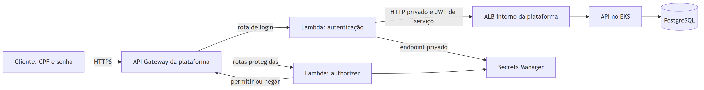
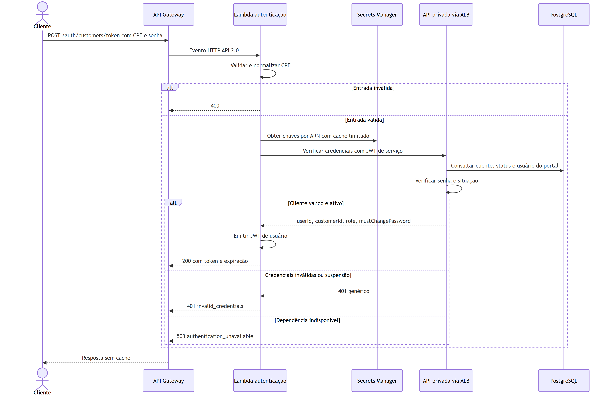
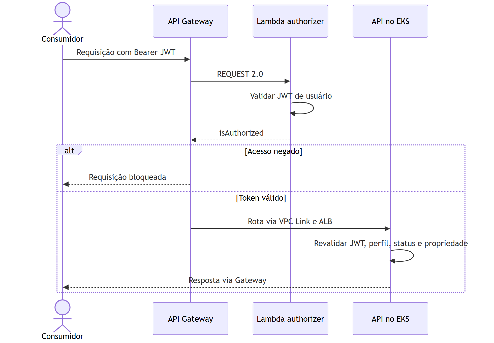

# GarageFlow — Serverless

Este README concentra a arquitetura, o contrato HTTP, as sequências e a operação das funções de autenticação por CPF e autorização do GarageFlow. O projeto entrega código .NET 10, pacote ZIP, Terraform das Lambdas, aliases e permissões de invocação. Regras de cadastro, senha, situação do cliente e propriedade da OS permanecem na aplicação.

## Sumário

- [Arquitetura](#arquitetura)
- [Sequência de autenticação](#sequência-de-autenticação)
- [Autorização das APIs](#autorização-das-apis)
- [Contrato HTTP](#contrato-http)
- [Runtime .NET](#runtime-net)
- [Configuração do runtime](#configuração-do-runtime)
- [Build, testes e pacote](#build-testes-e-pacote)
- [Infraestrutura serverless](#infraestrutura-serverless)
- [Deploy](#deploy)
- [Artefatos e decisões](#artefatos-e-decisões)

## Arquitetura



[Fonte editável do diagrama](docs/diagrams/serverless-components.mmd).

A autenticação está em subnets privadas da VPC; o authorizer fica fora da VPC. A [plataforma](https://github.com/DiegoRugue/garageflow-infra-kubernetes#readme) é dona do Gateway, rotas, VPC Link, ALB e segredos comuns. A [aplicação](https://github.com/DiegoRugue/GarageFlow#readme) é dona das regras e verificação interna. O [banco](https://github.com/DiegoRugue/garageflow-infra-database#readme) não é acessado por nenhuma Lambda.

O transporte público usa HTTPS gerenciado do Gateway; o trecho Lambda → ALB → API usa HTTP na VPC, sem criptografia de transporte interna. Security groups e JWT de serviço restringem o acesso. A solução Academy não exige domínio próprio/ACM; isso não equivale a TLS ponta a ponta.

## Sequência de autenticação



[Fonte editável do diagrama](docs/diagrams/customer-authentication.mmd).

O login administrativo continua em `POST /auth/login` na aplicação. CPF autentica apenas o cliente vinculado ao portal; a API mantém hashing, status e políticas. Segredos, CPF, senha e tokens não devem aparecer nos logs. O [RFC de identidade](https://github.com/DiegoRugue/GarageFlow/blob/main/docs/architecture/rfcs/0001-phase-3-platform-and-identity.md) especifica as identidades distintas dos JWTs.

## Autorização das APIs



[Fonte editável do diagrama](docs/diagrams/jwt-authorization.mmd).

O Gateway não mantém cache da decisão do authorizer (`TTL=0`). A Lambda verifica identidade do token; a API decide acesso ao recurso. Token válido de cliente não permite gestão administrativa ou leitura da OS de outra pessoa. O webhook usa HMAC na API, conforme o catálogo explícito de rotas da plataforma.

## Contrato HTTP

`POST /auth/customers/token`, `Content-Type: application/json`:

```json
{"cpf":"<CPF do cliente>","password":"<senha do portal>"}
```

Os valores acima são marcadores; use um cliente de teste cadastrado. A resposta de sucesso contém `token`, `mustChangePassword`, `tokenType` e `expiresIn`, com `Cache-Control: no-store`. `400` indica entrada inválida; `401` não distingue inexistência, suspensão ou senha incorreta; `503` indica indisponibilidade da autenticação. O authorizer é uma integração interna do Gateway e não um endpoint público para login.

A URL base HTTPS é descoberta pelo [contrato da plataforma](https://github.com/DiegoRugue/garageflow-infra-kubernetes#acesso-e-documentação-das-apis). Esta rota Lambda não integra o OpenAPI gerado pelo Host da aplicação: use este contrato no Postman. As APIs de negócio possuem [OpenAPI/Scalar local](https://github.com/DiegoRugue/GarageFlow#execução-e-documentação-da-api); `/internal/*` e documentação não são expostos pelo Gateway.

## Runtime .NET

O runtime usa .NET 10 (`net10.0`) no modelo de deployment por arquivo ZIP da runtime gerenciada `dotnet10`. O projeto `Host` é uma class library e contém somente tradução dos eventos AWS e composição das dependências. As regras e portas seguem para dentro pelas camadas `Domain`, `Application` e `Adapters.Infrastructure`; não há persistência nem referência à solução principal GarageFlow.

Os handlers publicados são:

- autenticação: `GarageFlow.Serverless.Host::GarageFlow.Serverless.Host.CustomerAuthenticationFunction::FunctionHandler`
- authorizer HTTP API REQUEST 2.0: `GarageFlow.Serverless.Host::GarageFlow.Serverless.Host.RequestAuthorizerFunction::FunctionHandler`

A função de autenticação atende `POST /auth/customers/token` no formato proxy HTTP API 2.0. O corpo JSON contém `cpf` e `password`; o CPF é validado e normalizado para 11 dígitos antes da chamada privada. A resposta de sucesso contém `token`, `mustChangePassword`, `tokenType` e `expiresIn`, com `Cache-Control: no-store`. O authorizer recebe um evento REQUEST 2.0 e devolve a resposta simples `isAuthorized`.

## Configuração do runtime

Somente ARNs dos segredos entram nas variáveis da Lambda. Os valores são buscados no AWS Secrets Manager pela cadeia normal de credenciais do runtime e permanecem em cache por no máximo 60 segundos.

| Variável | Função | Uso |
| --- | --- | --- |
| `JWT_SECRET_ARN` | ambas | ARN da chave HS256 dos JWTs de usuário |
| `INTERNAL_AUTH_SECRET_ARN` | autenticação | ARN da chave HS256 do token de serviço interno |
| `INTERNAL_API_BASE_URL` | autenticação | URL base fixa da API privada |
| `INTERNAL_API_TRANSPORT` | autenticação | `http` ou `https`, igual ao esquema da URL |
| `JWT_ISSUER` | ambas | emissor do JWT; padrão `GarageFlow` |
| `JWT_AUDIENCE` | ambas | audiência do JWT; padrão `GarageFlow.Adapters.Api` |

As chaves devem ter pelo menos 32 bytes UTF-8, não podem ser placeholders e devem ser diferentes. A operação HTTP tem limite de 5 segundos incluindo a leitura do corpo, não segue redirects e não repete solicitações. As duas funções propagam um prazo baseado no tempo restante da invocação, reservando 1 segundo para responder; esse prazo também abrange as consultas ao Secrets Manager. Ao esgotar o prazo, a autenticação retorna `503 authentication_unavailable` e o authorizer nega acesso. Erros de configuração, Secrets Manager, transporte ou identidade inválida não incluem credenciais, tokens ou respostas privadas na resposta HTTP.

## Build, testes e pacote

```powershell
dotnet build GarageFlow.Serverless.slnx --configuration Release
dotnet test Tests/Unit/GarageFlow.Serverless.Tests.Unit.csproj --configuration Release
dotnet test Tests/Integration/GarageFlow.Serverless.Tests.Integration.csproj --configuration Release
dotnet test GarageFlow.Serverless.slnx --configuration Release --settings coverlet.runsettings --collect:"XPlat Code Coverage"
dotnet publish Host/GarageFlow.Serverless.Host.csproj --configuration Release --runtime linux-x64 --self-contained false --output <diretorio-externo>
```

Testes de integração usam handlers HTTP controlados, tokens JWT reais e mocks do SDK do Secrets Manager. Eles não exigem credenciais AWS nem acesso à rede.

## Infraestrutura serverless

O módulo em `infra/serverless` usa Terraform `1.15.7` e AWS provider `6.49.0`. Ele cria duas funções Lambda `dotnet10` na arquitetura `x86_64`, publica uma versão imutável de cada função e mantém o alias `live` como destino estável. A função de autenticação usa 512 MB, timeout de 10 segundos e as sub-redes privadas de aplicação com o security group fornecido pelo contrato de ingress. O authorizer usa 256 MB, timeout de 5 segundos e permanece fora da VPC. Ambos os log groups retêm dados por sete dias.

O módulo não cria IAM. `authentication_role_arn` e `authorizer_role_arn` recebem roles preexistentes e podem apontar para o mesmo `LabRole`. Antes do plano, o deploy confirma a conta do caller e de todos os ARNs, a existência e identidade das roles, a associação das sub-redes e security groups à VPC, e que o listener pertence a um ALB interno. Em HTTP, o hostname da URL deve ser o DNS do ALB; em HTTPS, deve coincidir com `tlsServerName`. Somente ARNs de segredos entram nas variáveis das funções; valores de segredos não são lidos pelo deploy.

As entradas Terraform são `environment`, `owner`, `expires_on`, `platform_contract`, `ingress_contract`, `authentication_role_arn`, `authorizer_role_arn` e `package_path`. O contrato de plataforma v1 é consumido por completo. O contrato de ingress v2 inclui `listenerArn`, `internalApiBaseUrl`, `transport`, `authenticationSecurityGroupId`, `vpcLinkSecurityGroupId` e, somente para HTTPS, `tlsServerName`. As únicas saídas públicas são:

- `customerAuthenticationAliasArn`
- `requestAuthorizerAliasArn`

Testes locais do módulo usam exclusivamente o mock provider:

```powershell
terraform -chdir=infra/serverless fmt -check -recursive
terraform -chdir=infra/serverless init -backend=false -input=false
terraform -chdir=infra/serverless validate
terraform -chdir=infra/serverless test -no-color
```

## Deploy

O workflow de deploy aceita somente `develop` para `homologation` e `main` para `production`, sempre em `us-east-1`. Pushes nessas branches passam primeiro pelo quality gate. A execução manual exige o ambiente correspondente à branch selecionada e a confirmação do SHA completo. Configure os GitHub Environments `homologation` e `production` e suas regras de proteção. A existência do workflow não cria branches, Environments nem proteção. Cada Environment deve fornecer:

| Tipo | Nome |
| --- | --- |
| Secret | `AWS_ACCESS_KEY_ID` |
| Secret | `AWS_SECRET_ACCESS_KEY` |
| Secret | `AWS_SESSION_TOKEN` |
| Secret | `TF_STATE_BUCKET` |
| Secret | `AUTHENTICATION_ROLE_ARN` |
| Secret | `AUTHORIZER_ROLE_ARN` |
| Variable | `AWS_ACCOUNT_ID` |
| Variable | `TF_OWNER` |
| Variable | `TF_EXPIRES_ON` |

Antes de habilitar este workflow, o reusable workflow centralizado `deploy-edge.yml` da plataforma deve estar mergeado na branch `main` de `DiegoRugue/garageflow-infra-kubernetes`. Os dois callers usam essa fonte `@main`; nas chamadas entre repositórios, a plataforma valida seu código centralizado em `main` e implanta exatamente o SHA aprovado pelo quality gate. O ref protegido do caller seleciona o Environment e o state. Neste repositório serverless, `main` e `develop` devem existir e estar protegidas, e `develop` precisa ser criada durante o setup caso ainda não exista. Os nomes esperados de Environment são `production` e `homologation`.

O script baixa `contracts/v1/{environment}/platform.json` e `contracts/v2/{environment}/ingress.json` do bucket de estado para `RUNNER_TEMP`, valida os dois contratos e gera os tfvars apenas nesse diretório temporário. O pacote é criado fora do checkout com o SDK `.NET 10.0.301`:

```bash
dotnet publish Host/GarageFlow.Serverless.Host.csproj \
  --configuration Release \
  --runtime linux-x64 \
  --self-contained false \
  --output "$RUNNER_TEMP/publish"
```

O estado usa a chave `phase3/{environment}/serverless.tfstate`, criptografia e lock nativo do S3. O apply consome exatamente o plano salvo. Após as duas funções ficarem ativas, o script publica primeiro a revisão imutável `contracts/v1/{environment}/serverless/revisions/{sha}/{run-id}-{run-attempt}.json` com `If-None-Match: *` e depois atualiza `contracts/v1/{environment}/serverless.json`. Assim, uma recuperação pode repetir o mesmo commit em outra execução sem colidir com a revisão anterior. Só então os dois callers protegidos chamam o deploy reutilizável do edge da plataforma confiável, sob o mesmo proprietário, com `secrets: inherit`. Essa herança explícita permite resolver os secrets de deployment na chamada entre repositórios. O workflow centralizado usa a fonte `@main`, declara o mesmo Environment protegido selecionado pelo ref do caller e lê as credenciais e variáveis configuradas neste repositório, garantindo que a borda consuma aliases já publicados.

## Artefatos e decisões

| Artefato | Responsabilidade |
| --- | --- |
| [Host](Host) | Handlers HTTP API/authorizer e composição |
| [Application](Application) | Casos de uso e portas |
| [Domain](Domain) | Validação do CPF |
| [Adapters.Infrastructure](Adapters.Infrastructure) | HTTP privado, JWT e Secrets Manager |
| [Terraform](infra/serverless) | Funções, versões, aliases e permissões |
| [Deploy](.github/workflows/deploy-serverless.yml) | Pacote ZIP, contratos e chamada do edge |
| [Quality gate](.github/workflows/quality-gate.yml) | Build, testes, cobertura e IaC |
| [Execuções](https://github.com/DiegoRugue/garageflow-serverless/actions) | CI/CD deste repositório |
| [ADR de separação](https://github.com/DiegoRugue/GarageFlow/blob/main/docs/architecture/adrs/0001-four-repositories-on-aws-academy.md) | Propriedade dos quatro projetos |

O pacote usa runtime gerenciada e ZIP; Dockerfile não se aplica a este deploy. As funções não são instrumentadas no New Relic. Os dashboards da plataforma medem a API e o Kubernetes; não representam falhas da Lambda que não chegaram à API. A disponibilidade do endpoint depende da sessão Academy e da cadeia de deploy, não de uma URL fixa no README.
